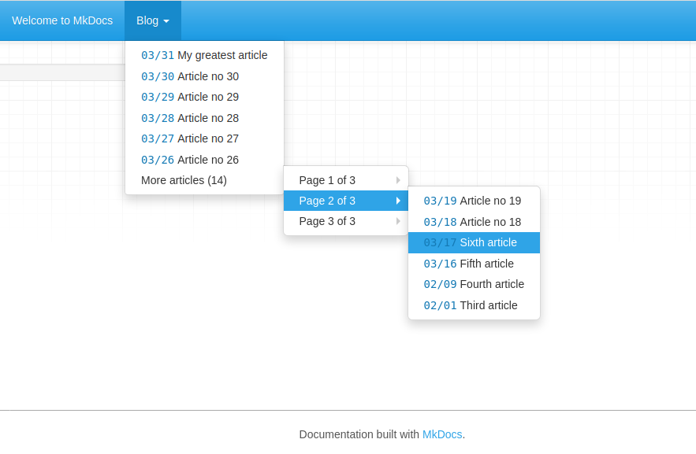

# &laquo; Blogs for MkDocs &raquo; (MkDocs-Blog-Plugin)

This plugin allows you to host a tiny blog 
section in your MkDocs site.  
Move away, WordPress... well, not really.



### How does it work ?

It's quite simple. 90% of the work is already done by 
MkDocs itself.
Each time you will build your MkDocs site or serve it, 
this plugin will try to find a specific directory 
in your documentation folder.  
If it finds it, every document and every subdirectory 
nested in it will be listed in reverse on the navbar.  
Plus, if you will have too many documents to be listed 
at once, the plugin will try to organize your remaining 
documents in subfolders. 

### How can I install it ?

You can install it through pip with this 
command:

```sh
pip install mkdocs-blog-plugin
```

Then, open your `mkdocs.yml` configuration 
file and add these lines:

```yaml
plugins:
    - blog
```

Last but not least, enter you `docs` folder 
and create a new subfolder and name it `blog`. 
This plugin will try to find blog articles 
inside this directory.  

Then you are ready to begin.

### How can I add new articles to my blog section ?

Inside `docs/blog` create a folder for each 
year you are planning to add new articles. 
Then, inside each year folder create twelve 
folders, numbered from `01` to `12` for each 
month. Finally, in each month folder for each day 
create a corresponding folder but remember to add 
a leading zero (for example: `08`, `09`, `10`, ...)  
Now, for every article you will go inside 
the corresponding `year/month/day folder and you 
will create a new file there.
While it is not necessary that you keep this 
strict naming convention, this will help the plugin 
to understand when your article was made.  

For example, this is how I manage my blog folder:

```sh
docs
├── blog
│   ├── 2019
│   └── 2020
│       ├── 01
│       │   ├── 20
│       │   │   └── first-article.md
│       │   └── 26
│       │       └── second-article.md
│       ├── 02
│       │   ├── 01
│       │   │   └── third_article.md
│       │   └── 09
│       │       └── fourth-article.md
│       └── 03
│           └── 16
│               └── fifth-article.md
└── index.md
```

### Customizing the plugins

You can customize this plugin by adding some parameters 
in the `mkdocs.yml` file, like this:

```yaml
- plugin:
      - blog:
          format: "(%m/%d/%y)"
          text-align: "right"
```

Here is a brief list of every parameters supported 
by the current version of the plugin:

#### folder 

This is the section / folder in which we'll try to 
build our blog

> Default value: "blog"

#### articles

How many articles do we have to display on our blog 
at once? More articles will be displayed in the 
corresponding subsection

> Default value: 6 articles

#### more-articles

Let's allow our user to slightly customize the 
"previous articles" section. How do we have to name 
this section if it will contains more articles? 
Remember to put a percentage character wherever you 
want this plugin to insert the number of available 
articles.

> Default value: "More articles (%)"

#### pagination

Which name do we have to give to each subsection 
inside our "more articles" section?  
Remember to put two percentage characters wherever you 
want this plugin to insert the actual number page and 
the total amount of pages made. 

> Default value: Page % of %"

#### display-more-articles

Can we display the previous articles section, or is it 
better if we hide it? 

> Default: True

#### display-article-date

Can we display the article date in the navbar, or is it 
better if we hide it?

> Default: True

#### format

How we have to display an article publication date on 
our navbar?  
You can use these placeholders inside your string:

- `%d` = Day  
- `%m` = Month  
- `%y` = Year (2-digits)  
- `%Y` = Year (4-digits)  

> Default value: "[%d/%m]"

#### text-align

Do we have to display an article publication date on 
the left side (`"left"`) or on the right side 
(`"right"`)?

> Default value: "left"
